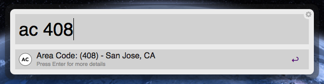
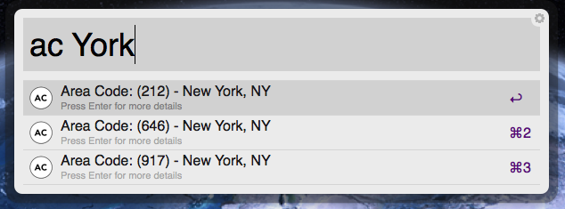

Area Code Lookup for Alfred
===========================

Requirements
------------
Requires Alfred 2.X or later. No internet connection is required for simple area code lookups. Selecting a result will open a page in your default browser with more information. This page will require internet access.

Usage
-----
Invoke Alfred 2, and type `ac` followed by your search query. The search query can be a full or partial area code, or even a full or partial city or state abbreviation. Hitting enter on one of the results will open a web page in your default browser with more information on that area code. 

Customize
---------
If you'd like to update the city names or add additional area codes, edit the `codes.txt` file found in the workflow package. To navigate there, option or right click on the workflow from within Alfred and select `Show in Finder`. Make sure to follow the same format as the other entries.

Screenshot
----------

Lookup via Area Code

Lookup via City Name

Contact
-------
[@davidklem](http://twitter.com/davidklem) - Follow me on Twitter  
[@klem](http://alpha.app.net/klem) - Follow me on App.net  
[GitHub](https://github.com/dklem?tab=repositories) - Check out my other workflows and projects
